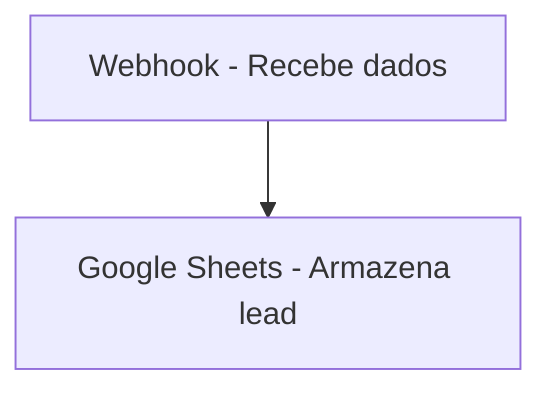

# 🤖 Automação de Leads com n8n + Google Sheets

Integração simples e poderosa utilizando **n8n**, **Webhook** e **Google Sheets** para coletar e registrar leads automaticamente.


---

## 🚀 Funcionalidades

✅ Recebe leads via Webhook  
✅ Salva automaticamente no Google Sheets  
✅ Fácil de integrar com sites, formulários e chatbots  
✅ Fluxo executando em nuvem  
✅ Zero código para manutenção

---

## 🔁 Arquitetura do fluxo



Fluxo no n8n:

```
Webhook → Google Sheets → Respond to Webhook
```

---

## 🧪 Teste o Webhook

Use CURL para enviar dados à automação:

```bash
curl -X POST "https://renandevrosa.app.n8n.cloud/webhook/lead" \
  -H "Content-Type: application/json" \
  -d '{"nome":"Maria","email":"maria@example.com","telefone":"(45)98888-7777"}'
```

✅ A planilha será atualizada automaticamente!

---

## 📊 Planilha de destino

Planilha: **Leads Automação n8n**

| Nome | Email | Telefone |
|------|-------|----------|
| Maria | maria@example.com | (45) 98888-7777 |

---

## 🧱 Tecnologias utilizadas

| Tecnologia | Uso |
|----------|-----|
| n8n Cloud | Automação e Webhook |
| Google Sheets API | Persistência dos dados |
| CURL | Teste do endpoint |

---

## 🛠️ Como executar seu próprio

1️⃣ Criar Workflow no n8n  
2️⃣ Configurar Webhook (POST `/lead`)  
3️⃣ Conectar Google Sheets  
4️⃣ Mapear campos do JSON  
5️⃣ Ativar o fluxo ✅

---

## 🎯 Objetivo profissional

Este projeto demonstra domínio em:

- Automação no-code com n8n
- Integração REST
- Manipulação de dados com APIs
- Processos automatizados em nuvem
- Construção de portfólio para vagas em tecnologia

---

## 👤 Autor

**Renan de Souza Rosa**

🔗 GitHub: https://github.com/dev-renanrosa  
📧 Email profissional: renan@example.com (trocar para o seu)

---

## 🚧 Melhorias futuras

- Validação dos dados antes do envio
- Notificação via Telegram/WhatsApp
- Trigger para páginas de captura

---

> ✅ Projeto pronto para ser apresentado em entrevistas
